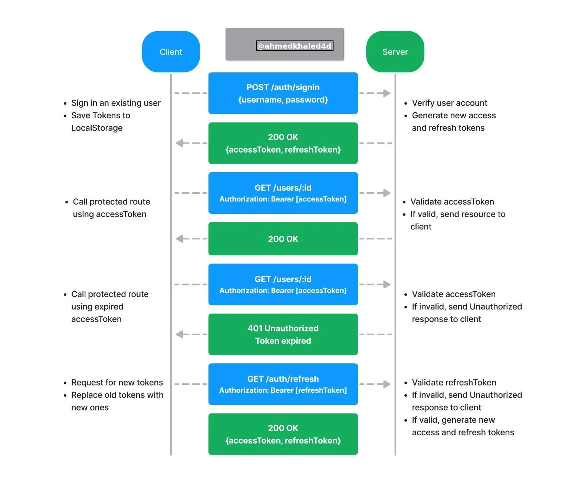

# Full Stack Test Task

module that would allow a user to sign up and sign in, to the application.
The access token is used to authenticate API requests to access protected resources, while the refresh token is used to obtain new access tokens once the current ones expire.

- nestjs
- react
- mongoose
- passport

    `docker-compose up --build`
